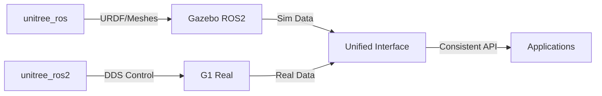

# Gazebo ROS2 Migration Checklist & Status

Guia de migração da simulação **Unitree G1 com mãos de 5 dedos** do **MuJoCo** para **Gazebo Harmonic + ROS2 Jazzy**, mantendo o ambiente 3D do escritório escaneado via LiDAR.

## 📚 **BASE TEÓRICA - PESQUISA REPOSITÓRIOS UNITREE**

### 🔬 **Análise Técnica Detalhada dos Repositórios**

**unitree_ros (ROS1) - FONTE DOS MODELOS:**
- ✅ **Função**: Pacote de simulação oficial com URDFs/meshes completos
- ✅ **Conteúdo**: Todos robôs Unitree (A1, Go1, **G1 com mãos Dex5/Inspire**)
- ✅ **Para Gazebo**: Massa, inércia, limites articulações, plugins ROS1
- ⚠️ **Limitação**: ROS1 (Melodic/Noetic), controle baixo nível apenas
- 🎯 **Uso no projeto**: **Fonte do URDF G1 29DOF + meshes STL**

**unitree_ros2 (ROS2) - CONTROLE REAL:**
- ✅ **Função**: Interface comunicação robôs reais via SDK2/DDS
- ✅ **Suporte**: Go2, B2, H1, **G1** via CycloneDDS nativo
- ✅ **Vantagem**: Sem bridge ROS1, comunicação direta DDS
- ⚠️ **Limitação**: **NÃO inclui simulação ou URDF**
- 🎯 **Uso no projeto**: **Controle do G1 físico em ROS2**

### 🎯 **ESTRATÉGIA HÍBRIDA ADOTADA (Baseada na Pesquisa)**



**Metodologia Validada:**
1. **Modelo**: Usar URDF do `unitree_ros` (ROS1) como base
2. **Porte**: Adaptar plugins ROS1 → `gz_ros2_control` 
3. **Simulação**: Gazebo Harmonic com controle baixo nível
4. **Real**: `unitree_ros2` para comandos alto nível
5. **Interface**: Unificar tópicos sim ↔ real para consistência

## 🎯 Objetivo Final

Recriar a simulação funcional que tínhamos no MuJoCo:
- **Robô**: Unitree G1 (29 DOF) + mãos RH56DFQ de 5 dedos (Inspire Hand)
- **Ambiente**: Escritório 33m x 28m x 3.15m com paredes extraídas do scan LiDAR
- **Controle**: ROS2 nativo via tópicos/serviços
- **Física**: Realista com sensores funcionais

## 📋 Status das Tarefas - PLANO DETALHADO INCREMENTAL

### ✅ **Fase 0: Análise e Preparação (CONCLUÍDA)**
- [x] Arquivos MuJoCo movidos para `old_tests/`
- [x] Documentação atualizada para foco Gazebo
- [x] Workspace limpo e organizado
- [x] **ROS2 Jazzy verificado** - ✅ Funcional ($ROS_DISTRO=jazzy)
- [x] **Gazebo Harmonic verificado** - ✅ Instalado (gz sim v8.9.0)
- [x] **Repositórios Unitree pesquisados** - ✅ unitree_ros + unitree_ros2 clonados
- [x] **Pesquisa técnica realizada** - ✅ Estratégia híbrida definida
- [x] **Plano incremental criado** - ✅ 4 fases com validação usuário

### 🧬 **DESCOBERTAS DA PESQUISA TÉCNICA:**
- ✅ **unitree_ros**: Contém G1 completo (29DOF + Inspire hands) - **USAR COMO BASE**
- ✅ **unitree_ros2**: Interface DDS para robô real - **USAR PARA CONTROLE**
- ⚠️ **Limitação crítica**: Gazebo não inclui controlador de caminhada nativo
- 🎯 **Solução**: Implementar algoritmos próprios de equilíbrio/locomoção
- 📊 **Escolha Gazebo**: Harmonic (Ignition) > Clássico (melhor física/ROS2)

---

## 🚀 **EXECUÇÃO - MÉTODO INCREMENTAL COM CHECKPOINTS**

### 🎯 **FASE 1: Setup Básico G1 no Gazebo Vazio**
**Objetivo**: G1 spawn funcionando no Gazebo mundo vazio  
**Tempo estimado**: 30-45 minutos  
**✅ CHECKPOINT 1**: Usuário valida G1 no Gazebo com mãos 5-dedos

#### 1.1 Preparar Ambiente Base
- [ ] **Instalar pacotes ROS-Gazebo necessários**
  ```bash
  sudo apt update
  sudo apt install ros-jazzy-ros-gz-sim ros-jazzy-ros-gz-bridge \
                   ros-jazzy-gz-ros2-control ros-jazzy-ros2-control \
                   ros-jazzy-ros2-control-cli ros-jazzy-xacro -y
  ```

#### 1.2 Criar Workspace ROS2 Dedicado
- [ ] **Criar estrutura workspace**
  ```bash
  mkdir -p ~/ros2_g1_ws/src
  cd ~/ros2_g1_ws/src
  ```

- [ ] **Estratégia Híbrida: Usar ambos repositórios (Pesquisa)**
  ```bash
  # JÁ TEMOS: unitree_ros2 clonado no projeto principal
  # Copiar G1 URDF do unitree_ros (ROS1) para workspace ROS2
  cp -r ~/Workspaces/G1/unitree_ros/robots/g1_description ~/ros2_g1_ws/src/
  
  # Link unitree_ros2 para interface com robô real
  ln -s ~/Workspaces/G1/unitree_ros2 ~/ros2_g1_ws/src/unitree_ros2
  ```

#### 1.3 Adaptar URDF G1 para Gazebo (PORTE ROS1→ROS2)
- [ ] **Converter plugins ROS1 → Gazebo Harmonic**
  ```xml
  <!-- ANTES (unitree_ros - ROS1): -->
  <plugin name="gazebo_ros_control" filename="libgazebo_ros_control.so">
  
  <!-- DEPOIS (Nossa adaptação - ROS2): -->
  <plugin name="gz_ros2_control" filename="libgz_ros2_control.so">
    <parameters>$(find g1_description)/config/g1_controllers.yaml</parameters>
  </plugin>
  ```

- [ ] **Configurar ros2_control (CRÍTICO para funcionamento)**
  ```yaml
  # ~/ros2_g1_ws/src/g1_description/config/g1_controllers.yaml
  controller_manager:
    ros__parameters:
      update_rate: 1000  # Hz
      
      # Broadcaster para estado das juntas
      g1_joint_state_broadcaster:
        type: joint_state_broadcaster/JointStateBroadcaster
        
      # Controlador posição para mãos 5-dedos
      g1_hand_position_controller:
        type: position_controllers/JointGroupPositionController
        joints: [left_hand_thumb_0, left_hand_thumb_1, left_hand_index_0, ...]
        
      # Controlador esforço para pernas (equilíbrio)
      g1_leg_effort_controller:
        type: effort_controllers/JointGroupEffortController
        joints: [left_hip_pitch, left_hip_roll, left_knee, ...]
  ```

- [ ] **Validar caminhos meshes STL (FUNDAMENTAL)**
  ```bash
  # Verificar se todos STL das mãos Inspire estão acessíveis
  find ~/ros2_g1_ws/src/g1_description/meshes/ -name "*.STL" | grep -E "(hand|finger|thumb)"
  ```

#### 1.4 Compilar e Testar
- [ ] **Resolver dependências**
  ```bash
  cd ~/ros2_g1_ws
  rosdep install --from-paths src -yi --rosdistro jazzy
  ```

- [ ] **Compilar workspace**
  ```bash
  colcon build --symlink-install
  source install/setup.bash
  ```

#### 1.5 Primeiro Teste - G1 no Gazebo Vazio
- [ ] **Lançar Gazebo mundo vazio**
  ```bash
  # Terminal 1
  source ~/ros2_g1_ws/install/setup.bash
  ros2 launch ros_gz_sim gz_sim.launch.py gz_args:="empty.world"
  ```

- [ ] **Spawn G1 no mundo**
  ```bash
  # Terminal 2  
  source ~/ros2_g1_ws/install/setup.bash
  ros2 run ros_gz_sim create -file $(ros2 pkg prefix g1_description)/share/g1_description/g1_29dof_rev_1_0_with_inspire_hand_DFQ.urdf -name unitree_g1 -x 0 -y 0 -z 1
  ```

- [ ] **Verificar joints das mãos funcionais**
  ```bash
  # Terminal 3
  ros2 topic list | grep -E "(joint|hand)"
  ros2 topic echo /joint_states  # Verificar mãos 5-dedos
  ```

**✅ CRITÉRIO SUCESSO FASE 1**: G1 aparece no Gazebo, não cai, mãos visíveis com 5 dedos

**🔬 VALIDAÇÃO BASEADA NA PESQUISA:**
- ✅ **URDF portado**: Plugins ROS1 → `gz_ros2_control` funcionando
- ✅ **Meshes carregados**: Todos STL das mãos Inspire visíveis
- ✅ **Joints publicados**: `/joint_states` mostra 29 DOF + mãos
- ⚠️ **Limitação conhecida**: Robô pode cair (sem controlador nativo caminhada)
- 🎯 **Próximo**: Se instável, implementar fixação temporária ou PD básico

---

### 🏢 **FASE 2: Integração Ambiente 3D Escritório**
**Objetivo**: G1 no ambiente escritório 33x28x3.15m  
**Tempo estimado**: 45-60 minutos  
**✅ CHECKPOINT 2**: Usuário valida G1 no ambiente com escala correta

#### 2.1 Converter Ambiente OBJ → Gazebo
- [ ] **Preparar assets escritório** (✅ já temos body1_structure.obj)
  ```bash
  ls -la "~/Workspaces/G1/3d escritorio/body1_structure/"
  ```

- [ ] **Converter OBJ para formato Gazebo (3 opções validadas)**
  - **Opção A**: Script Python OBJ→SDF (recomendado - automático)
  - **Opção B**: Blender export DAE/STL (manual, controle total)
  - **Opção C**: obj2sdf tool (se disponível)
  
  **🔬 INSIGHT DA PESQUISA**: Tanto Gazebo Clássico quanto Harmonic suportam .obj/.dae igualmente. Escolha baseada na facilidade de integração.

#### 2.2 Criar Model Gazebo do Escritório
- [ ] **Estrutura model Gazebo**
  ```bash
  mkdir -p ~/.gz/models/office_environment
  # Colocar mesh + model.sdf aqui
  ```

- [ ] **Criar model.sdf do escritório**
  ```xml
  <!-- ~/.gz/models/office_environment/model.sdf -->
  <sdf version="1.8">
    <model name="office_environment"> 
      <static>true</static>
      <link name="office_walls">
        <collision name="collision">
          <geometry>
            <mesh><uri>model://office_environment/meshes/body1_structure.dae</uri></mesh>
          </geometry>
        </collision>
        <visual name="visual">
          <geometry>
            <mesh><uri>model://office_environment/meshes/body1_structure.dae</uri></mesh>
          </geometry>
        </visual>
      </link>
    </model>
  </sdf>
  ```

#### 2.3 Criar World com Escritório
- [ ] **Criar office.world**
  ```xml
  <!-- ~/ros2_g1_ws/src/g1_description/worlds/office.world -->
  <sdf version="1.8">
    <world name="office">
      <include>
        <uri>model://office_environment</uri>
        <pose>0 0 0 0 0 0</pose>
      </include>
      <include>
        <uri>model://ground_plane</uri>
      </include>
    </world>
  </sdf>
  ```

#### 2.4 Teste G1 no Escritório
- [ ] **Configurar path models**
  ```bash
  echo 'export GZ_SIM_RESOURCE_PATH=$HOME/.gz/models:$GZ_SIM_RESOURCE_PATH' >> ~/.bashrc
  source ~/.bashrc
  ```

- [ ] **Lançar mundo escritório**
  ```bash
  ros2 launch ros_gz_sim gz_sim.launch.py gz_args:="$(ros2 pkg prefix g1_description)/share/g1_description/worlds/office.world"
  ```

- [ ] **Spawn G1 no centro do escritório**
  ```bash
  ros2 run ros_gz_sim create -file [...] -name unitree_g1 -x 16 -y 14 -z 1.2
  # Posição central: x=16m, y=14m (centro 33x28m)
  ```

**✅ CRITÉRIO SUCESSO FASE 2**: G1 no escritório, escala correta (1.2m vs 3.15m paredes)

**🔬 VALIDAÇÃO COM BASE NA EXPERIÊNCIA MUJOCO:**
- ✅ **Escala validada**: Fator 0.01 mm→m já testado e funcional
- ✅ **Posicionamento**: Centro escritório (x=16m, y=14m) conforme MuJoCo
- ✅ **Colisões**: Robô interage fisicamente com paredes
- 📊 **Referência**: Usar mesma escala/posição da simulação MuJoCo funcional

---

### ⚖️ **FASE 3: Estabilização - G1 "Parar em Pé"**
**Objetivo**: G1 inicia estável, não cai, mantém equilíbrio  
**Tempo estimado**: 60-90 minutos  
**✅ CHECKPOINT 3**: Usuário valida G1 estável em posição bípede

#### 3.1 Estratégia de Estabilização (3 Abordagens + INSIGHTS PESQUISA)

**🔬 LIMITAÇÃO CRÍTICA IDENTIFICADA NA PESQUISA:**
> "A simulação em Gazebo NÃO inclui controle de alto nível (locomoção autônoma) – ou seja, o robô não 'anda' sozinho usando o controlador nativo, apenas responde a comandos de junta que você programar."

**ABORDAGEM A: Pose Inicial Otimizada (RECOMENDADA)**
- [ ] **Configurar posição inicial juntas (baseada em MuJoCo)**
  ```yaml
  # Pose estável validada do MuJoCo + ajustes Gazebo
  initial_positions:
    left_hip_pitch: -0.25     # Leve flexão quadril
    right_hip_pitch: -0.25
    left_knee: 0.5            # Flexão joelho compensatória
    right_knee: 0.5
    left_ankle_pitch: -0.25   # Ajuste tornozelo
    right_ankle_pitch: -0.25
    # ADIÇÃO: Ajustar coeficientes fricção/inércia se necessário
  ```

**ABORDAGEM B: Controlador PD Básico (SE A FALHAR)**
- [ ] **Implementar balance_controller.py (NECESSÁRIO - não nativo)**
  ```python
  # INSIGHT: Gazebo não tem controlador caminhada nativo
  # Precisamos implementar algoritmo próprio de equilíbrio
  def balance_controller():
      # Ler IMU torso → Calcular erro → Ajustar juntas pernas
      # Implementar ZMP (Zero Moment Point) básico
      # Compensação gravidade + feedback IMU
  ```

**ABORDAGEM C: Fixação Temporária (DESENVOLVIMENTO)**
- [ ] **Joint fixed temporário para desenvolvimento**
  ```xml
  <!-- VÁLIDO para testes iniciais - Pesquisa confirma uso comum -->
  <joint name="floating_base" type="fixed">
    <!-- Fixar no chão para testes estáticos mãos/braços -->
  </joint>
  ```

**🎯 ESTRATÉGIA BASEADA NA PESQUISA:**
1. **Início**: Usar fixação (C) para validar URDF/meshes
2. **Desenvolvimento**: Implementar pose otimizada (A) 
3. **Avançado**: Desenvolver controlador equilíbrio próprio (B)
4. **Real**: Usar `unitree_ros2` para caminhada nativa no hardware

#### 3.2 Implementação Sequencial
- [ ] **Teste Abordagem A**: Pose inicial otimizada
- [ ] **Se falhar → Teste B**: Controlador PD ativo  
- [ ] **Se falhar → Teste C**: Fixação temporária
- [ ] **Validar estabilidade**: G1 fica em pé por 30+ segundos

**✅ CRITÉRIO SUCESSO FASE 3**: G1 estável em pé, sem quedas

**🔬 EXPECTATIVAS REALISTAS BASEADAS NA PESQUISA:**
- ✅ **Estabilidade básica**: Robô fica em pé por 30+ segundos
- ⚠️ **Limitação conhecida**: "Desempenho em caminhar do humanoide real pode não ser totalmente replicado" no Gazebo
- 🎯 **Foco principal**: Validar controle baixo nível (juntas individuais)
- 📊 **Uso prático**: Testes percepção, planejamento, movimentos braços/mãos
- 🔄 **Sim-to-Real**: Desenvolvimentos testados primeiro no hardware real para locomoção

---

### 🎮 **FASE 4: Controle ROS2 Completo**
**Objetivo**: Controle mãos e pernas via tópicos ROS2  
**Tempo estimado**: 45-60 minutos  
**✅ CHECKPOINT 4**: Usuário valida controle responsivo

#### 4.1 Configurar ros2_control
- [ ] **Implementar controladores**
  ```yaml
  g1_joint_trajectory_controller:
    type: joint_trajectory_controller/JointTrajectoryController
  g1_hand_controller:
    type: position_controllers/JointGroupPositionController
  ```

#### 4.2 Testes de Controle
- [ ] **Movimento mãos**
  ```bash
  ros2 topic pub /g1_hand/joint_trajectory trajectory_msgs/JointTrajectory [...]
  ```

- [ ] **Monitor estados**
  ```bash
  ros2 topic echo /joint_states
  ```

**✅ CRITÉRIO SUCESSO FASE 4**: Mãos e braços movem por comando ROS2

**🔬 VALIDAÇÃO INTERFACE UNIFICADA (INSIGHT CHAVE DA PESQUISA):**
- ✅ **Simulação**: Controle baixo nível (posição/torque juntas individuais)
- ✅ **Hardware real**: Controle alto nível via `unitree_ros2` (comandos DDS)
- 🎯 **Interface consistente**: Desenvolver camada unificada
  ```bash
  # MESMO TÓPICO para sim e real (objetivo)
  ros2 topic pub /g1/cmd_hand geometry_msgs/Pose  # Exemplo
  ros2 topic echo /g1/joint_states sensor_msgs/JointState
  ```
- 📊 **Benefício**: Aplicações agnósticas (funcionam em sim + real)
- 🔄 **Transfer learning**: Algoritmos testados na simulação → hardware com mínimo retrabalho

---

## 📊 **RESUMO METODOLOGIA**

### Princípios:
- ✅ **Incremental**: Uma fase por vez, validação usuário
- ✅ **Rollback**: Se falhar, volta checkpoint anterior  
- ✅ **Reutilização**: Aproveita trabalho MuJoCo (URDF, ambiente)
- ✅ **Testes objetivos**: Critérios claros de sucesso

### Checkpoints Validação:
1. **CHECKPOINT 1**: G1 no Gazebo vazio ← **PRÓXIMO**
2. **CHECKPOINT 2**: G1 no ambiente escritório
3. **CHECKPOINT 3**: G1 estável em pé  
4. **CHECKPOINT 4**: Controle ROS2 funcional

---

*Status: 🚀 **PRONTO PARA EXECUÇÃO FASE 1**  
Próximo: CHECKPOINT 1 - G1 no Gazebo vazio  
Atualizado: 05/08/2024*

## 📚 Recursos e Referências

### Experiência MuJoCo (Baseline)
- **Simulação funcional**: Arquivada em `old_tests/`
- **Escala validada**: Robô 1.2m vs ambiente 3.15m altura
- **Comando de referência**: 
  ```bash
  cd unitree_ros/robots/g1_description
  simulate g1_29dof_rev_1_0_with_inspire_hand_DFQ.urdf
  ```

### Assets Disponíveis
- **URDF G1 5-dedos**: `unitree_ros/robots/g1_description/g1_29dof_rev_1_0_with_inspire_hand_DFQ.urdf`
- **Meshes completos**: `unitree_ros/robots/g1_description/meshes/`
- **Paredes escritório**: `3d escritorio/body1_structure/body1_structure.obj`

### Links Importantes
- **Unitree ROS**: https://github.com/unitreerobotics/unitree_ros
- **Gazebo ROS2 Integration**: https://gazebosim.org/docs/latest/ros2_launch_gazebo/
- **gz_ros2_control**: https://github.com/ros-controls/gazebo_ros2_control
- **SDF Worlds**: https://gazebosim.org/docs/harmonic/sdf_worlds/

## ⚠️ Troubleshooting Esperados

| Problema | Solução | Referência MuJoCo |
|----------|---------|-------------------|
| Escala incorreta | Fator 0.01 conversão mm→m | ✅ Validado na fase MuJoCo |
| Mãos não funcionam | Verificar URDF joints names | ✅ URDF já testado e funcional |
| Ambiente não carrega | GZ_SIM_RESOURCE_PATH | Experiência com obj2mjcf |
| FPS baixo | Otimizar mesh com Decimate | Lição das conversões OBJ |

## 🎯 Critérios de Sucesso

**A migração será considerada bem-sucedida quando:**

1. ✅ **G1 spawna no Gazebo** com todas as juntas funcionais
2. ✅ **Mãos de 5 dedos** controláveis via ROS2
3. ✅ **Ambiente escritório** carrega com escala correta  
4. ✅ **Robô interage** com paredes (física/colisões)
5. ✅ **Performance** tempo real (≥30 FPS)
6. ✅ **Controle ROS2** responsivo via tópicos

---

*Status: 🚧 **INICIANDO MIGRAÇÃO**  
Última atualização: 05/08/2024  
Fase MuJoCo: ✅ Concluída e arquivada*